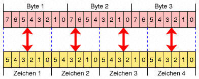

- **Base64** ist ein Verfahren zur **Kodierung von 8-Bit-Binärdaten**(z.B. ausführbare Programme,ZIP-Dateien oder Bilder) in eine Zeichenfolge, die **nur aus lesbaren ASCII-Zeichen besteht**.
- Der Platzbedarf des Datenstroms steigt um 33–36%
	- **33%** durch die **Kodierung** selbst
	- **bis zu weitere 3%** durch die im Datenstrom eingefügten **Zeilenumbrüche**
- Zur Kodierung werden die Zeichen `A–Z`, `a–z`, `0–9`, `+` und `/` verwendet sowie `=` am Ende.

**Padding** sorgt dafür, dass die kodierte Zeichenkette immer eine **Länge hat, die ein Vielfaches von 4 ist**. Das ist notwendig, weil Base64 **Daten in 6-Bit-Blöcke** zerlegt, aber ein Byte aus 8 Bits besteht – es entsteht also manchmal "Rest", den man auffüllen muss.

- Base64 verarbeitet **immer 3 Bytes (24 Bit)** auf einmal und wandelt sie in **4 Zeichen zu je 6 Bit** um.
- Jeder dieser 6-Bit-Blöcke bildet eine Zahl von 0 bis 63.
- Wenn **nicht genug Bytes** vorhanden sind (z.B. nur 1 oder 2 statt 3), wird der fehlende Teil mit **nullen** aufgefüllt, und ein oder zwei `=` Zeichen werden bei Ausgabe angehängt
	- 1 von 3 Bytes vorhanden: 2 `=` werden angehängt
	- 2 von 3 Bytes vorhanden: 1 `=` wird angehängt

**Beispiele**:

|Eingabe (ASCII)|Bytes|Base64 (ohne Padding)|Mit Padding|
|---|---|---|---|
|`M`|1 Byte|`TQ`|`TQ==`|
|`Ma`|2 Bytes|`TWE`|`TWE=`|
|`Man`|3 Bytes|`TWFu`|`TWFu`|

- Der Empfänger weiß dank Padding, wie viele Bytes **ursprünglich vorhanden** waren.
- Fehlt das Padding, kann die **Dekodierung fehlschlagen** oder zu falschen Daten führen.