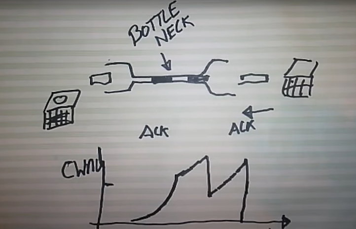

- **Congestion Collapse**:
	- Ein Zustand, in dem das **Internet durch zu viele gleichzeitige Datenübertragungen überlastet** wird. Obwohl Datenpakete gesendet werden, erreichen sie ihr Ziel nicht effizient, was zu einem **drastischen Leistungsabfall** führt. 
- **Ursachen**:
	- **Fehlende** oder **ineffektive Mechanismen zur Flusskontrolle** und **Überlastvermeidung** in Netzwerken. Insbesondere in den frühen Tagen des Internets war das Protokoll TCP nicht ausreichend darauf ausgelegt, mit solchen Situationen umzugehen. 
- **TCP Congestion Control**
	- **1. Slow Start (langsames Anlaufen)** 
		- Beim **Verbindungsaufbau beginnt** der **Sender mit einer kleinen Datenmenge** (meist ein oder zwei Pakete). 
		- **Nach jedem erfolgreichen Empfang** einer Bestätigung (**ACK**) **verdoppelt sich die Datenrate** (exponentielles Wachstum). 
		- Dies geschieht, **bis eine Schwelle** („ssthresh“) **erreicht wird oder Paketverlust** eintritt. 
	- **2. Congestion Avoidance (Überlastungsvermeidung)** 
		- **Nach Erreichen der Schwelle** **verlangsamt** sich das **Wachstum** der Datenrate – jetzt wird die **Sendeleistung nur noch linear gesteigert**. 
		- So tastet sich der Sender vorsichtig an das Maximum der Netzwerkleistung heran. 
	- **3. Fast Retransmit & Fast Recovery** 
		- Wenn ein Paket verloren geht, erkennt der Sender dies anhand doppelter ACKs. 
		- Statt lange zu warten, **sendet** er das **fehlende Paket sofort neu** (Fast Retransmit). 
		- Danach **verringert er die Datenrate um die Hälfte**, springt aber nicht ganz zurück auf den Anfang – **Fast Recovery sorgt für ein kontrolliertes Wiederansteigen**.

**Aktuelle Relevanz:**
- Obwohl moderne Netzwerke besser ausgestattet sind, um mit hohem Datenverkehr umzugehen, bleibt das Verständnis von Congestion Collapse wichtig, insbesondere im Kontext von Streaming-Diensten, Online-Gaming und anderen bandbreitenintensiven Anwendungen.